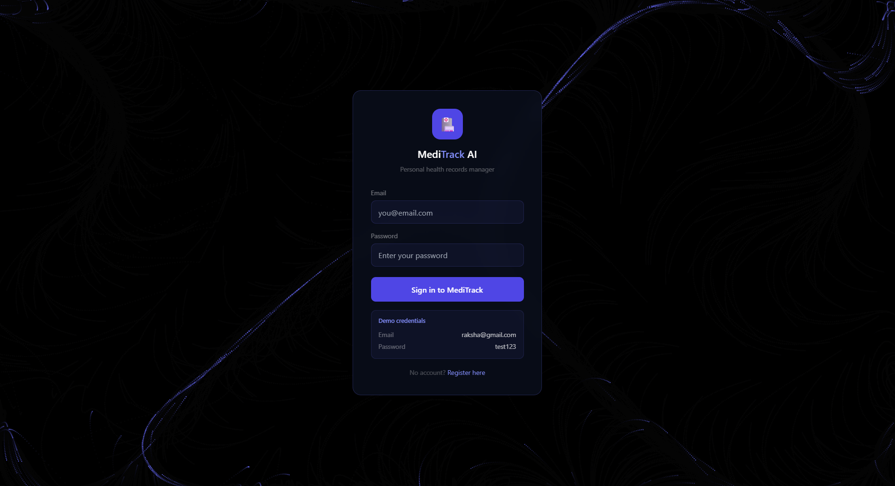
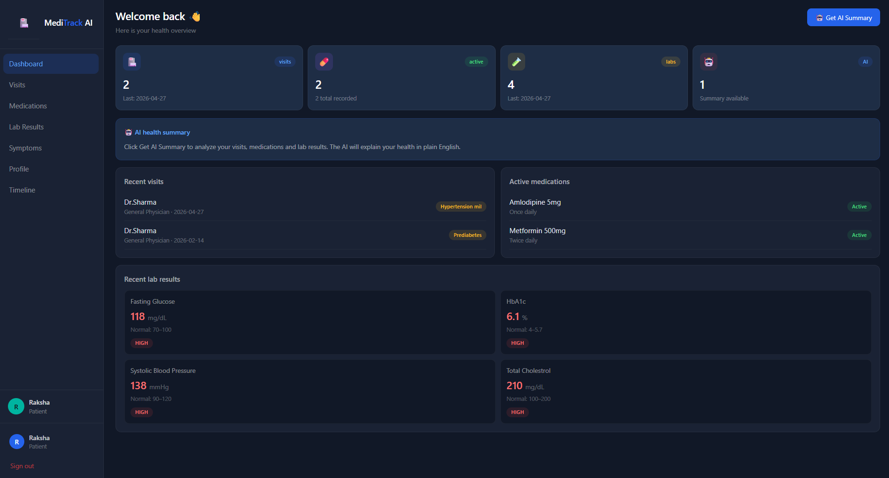
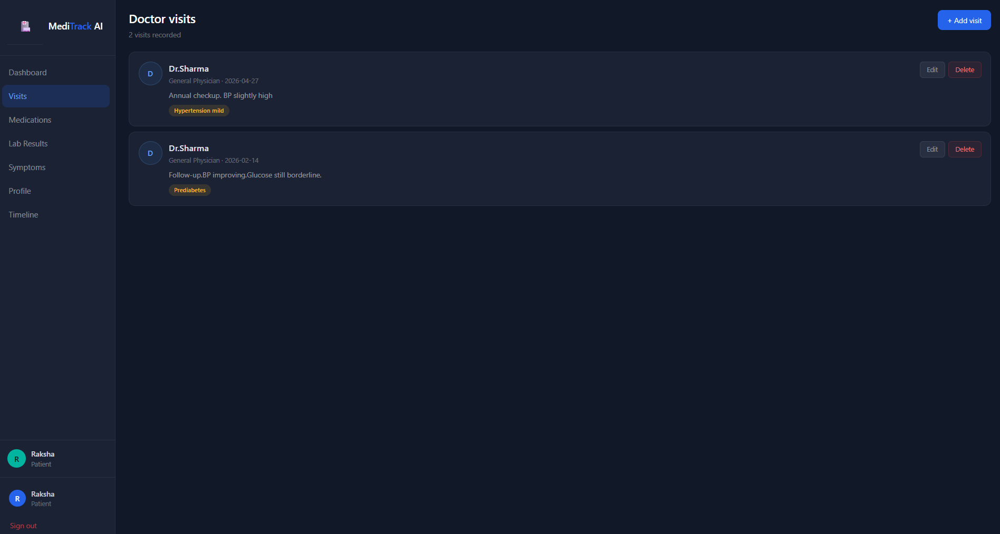
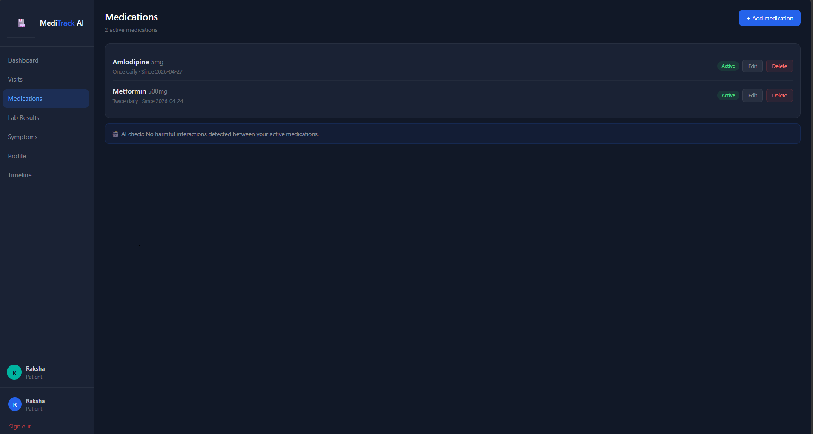
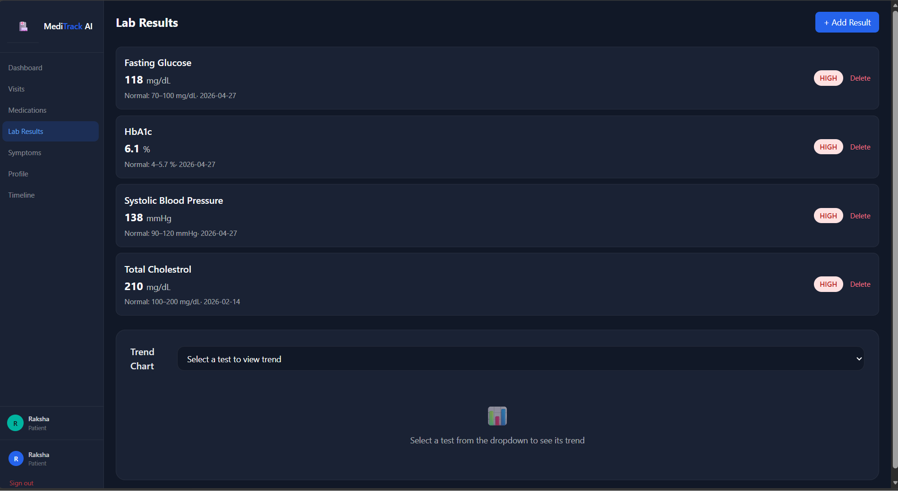
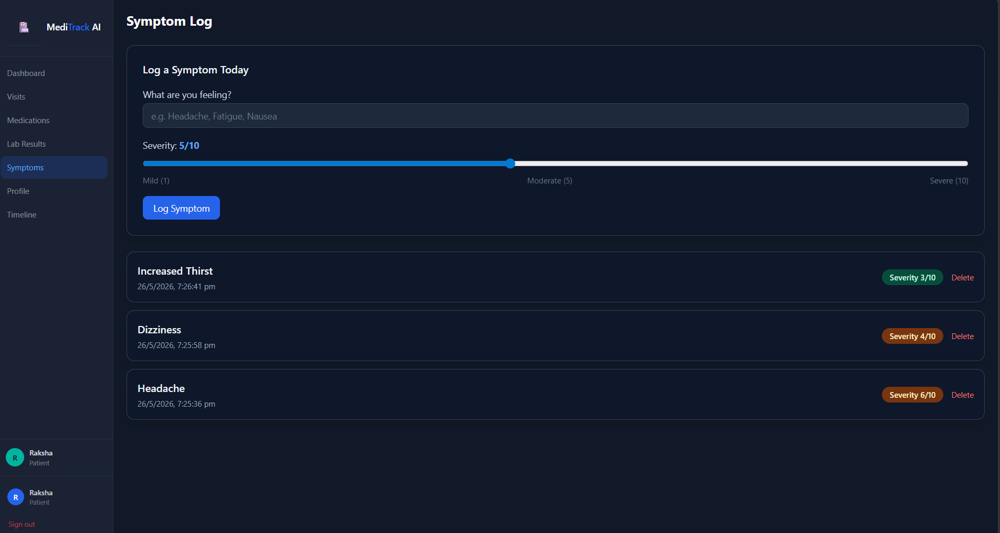

# MediTrack AI 🏥


MediTrack AI is a full stack personal health records manager built as a DBMS project. It runs locally and lets patients manage doctor visits, medications, lab results and daily symptoms — with an AI layer powered by Groq that reads all records and generates a plain English health summary.

---

## Project Overview

The application provides a patient dashboard, health records management, and an AI insights panel on top of a normalized PostgreSQL database. Patients can log in, view their health data, track medications, record lab results with automatic HIGH/LOW/NORMAL flagging, and get AI-powered health summaries. A trend chart shows lab values over time with rising/falling analysis.

---

## Demo

### Login Page
> Flow field particle animation background with glassmorphism login card



### Dashboard
> Stat cards, recent visits, active medications, lab results and AI summary



### Visits Page
> Full CRUD — add, view, edit and delete doctor visits with diagnosis badges



### Medications Page
> Track active medications with dosage, frequency and AI interaction check



### Lab Results Page
> Record blood tests with automatic HIGH/LOW/NORMAL detection and trend chart



### Symptoms Page
> Log daily symptoms with severity slider and colour coded history



---

## Features

- 🔐 User registration and login with session management
- 🏥 Doctor visit logging with diagnosis, notes and CRUD operations
- 💊 Medication tracker with dosage, frequency, active/inactive status
- 🧪 Lab results with automatic HIGH / LOW / NORMAL badge detection
- 📊 Interactive Recharts trend chart showing lab values over time
- 🩺 Daily symptom logger with 1–10 severity slider
- 🤖 AI health summary powered by Groq Llama 3.3 — plain English, no jargon
- 👤 Personal profile page with blood type and health overview

---

## Tech Stack

| Layer | Technology |
|---|---|
| Frontend | React.js 18, Tailwind CSS, Recharts |
| Backend | Node.js, Express.js |
| Database | PostgreSQL 15 |
| AI | Groq API — Llama 3.3  |
| HTTP Client | Axios |
| Version Control | Git + GitHub |

---

## Database Schema

The project uses **6 normalized tables**:

| Table | Purpose |
|---|---|
| `users` | Patient login and profile data |
| `visits` | Doctor visit records with diagnosis |
| `medications` | Medication tracking with dosage and frequency |
| `lab_results` | Blood test results with reference ranges |
| `symptoms` | Daily symptom log with severity |
| `ai_insights` | Cached AI-generated health summaries |

### Relationship Summary

- One user has many visits, medications, lab results and symptoms
- Lab results optionally reference a specific visit through `visit_id`
- All tables cascade delete when a user is removed
- Foreign key constraints enforce data integrity automatically

---

## SQL Operations Covered

| Operation | Where used |
|---|---|
| `INSERT` | Add new visits, medications, lab results, symptoms |
| `SELECT` | Fetch records by user_id with ORDER BY and LIMIT |
| `UPDATE` | Edit visit notes and diagnosis |
| `DELETE` | Remove records with foreign key constraint handling |
| `DEFAULT` | Auto timestamps, is_active defaults to TRUE |
| `CHECK` | Severity must be between 1 and 10 |
| `REFERENCES` | Foreign keys between all tables and users |

---

## Project Structure

```
meditrack-ai/
├── database/
│   └── schema.sql
├── server/
│   ├── config/
│   │   └── db.js
│   ├── routes/
│   │   ├── users.js
│   │   ├── visits.js
│   │   ├── medications.js
│   │   ├── labs.js
│   │   ├── symptoms.js
│   │   └── ai.js
│   ├── services/
│   │   └── aiService.js
│   ├── .env.example
│   └── index.js
└── client/
    └── src/
        ├── components/
        │   └── ui/
        │       └── FlowField.jsx
        ├── pages/
        │   ├── Login.jsx
        │   ├── Register.jsx
        │   ├── Dashboard.jsx
        │   ├── Visits.jsx
        │   ├── Medications.jsx
        │   ├── Labs.jsx
        │   ├── Symptoms.jsx
        │   └── Profile.jsx
        ├── App.js
        └── api.js
```

---

## Setup Instructions

### Prerequisites

- Node.js v18 or higher
- PostgreSQL 15 or higher
-  Groq API key from [console.groq.com](https://console.groq.com)

### 1. Clone the repository

```bash
git clone https://github.com/rakshaa2006/meditrack-ai.git
cd meditrack-ai
```

### 2. Set up the database

```bash
psql -U postgres
CREATE DATABASE meditrack_db;
\c meditrack_db
```

Then paste the contents of `database/schema.sql` into the psql terminal.

### 3. Set up the backend

```bash
cd server
npm install
cp .env.example .env
```

Edit `.env` and fill in your values:

```env
PORT=5000
DB_HOST=localhost
DB_USER=postgres
DB_PASSWORD=your_password
DB_NAME=meditrack_db
JWT_SECRET=your_secret_key
GROQ_API_KEY=your_groq_key
```

Start the backend:

```bash
npm run dev
```

You should see: `Server running on port 5000`

### 4. Set up the frontend

```bash
cd ../client
npm install
npm start
```

Browser opens at `http://localhost:3000`

---

## Environment Variables

Create `server/.env` with these values (see `.env.example` for template):

```
PORT=5000
DB_HOST=localhost
DB_USER=postgres
DB_PASSWORD=your_postgres_password
DB_NAME=meditrack_db
JWT_SECRET=any_random_secret_string
GROQ_API_KEY=your_groq_api_key
```

---

## API Routes

| Method | Route | Description |
|---|---|---|
| POST | `/api/users` | Register new user |
| GET | `/api/users` | Get all users |
| POST | `/api/visits` | Add a visit |
| GET | `/api/visits/:userId` | Get all visits for user |
| PUT | `/api/visits/:id` | Update a visit |
| DELETE | `/api/visits/:id` | Delete a visit |
| POST | `/api/medications` | Add a medication |
| GET | `/api/medications/:userId` | Get all medications |
| DELETE | `/api/medications/:id` | Delete a medication |
| POST | `/api/labs` | Add a lab result |
| GET | `/api/labs/:userId` | Get all lab results |
| DELETE | `/api/labs/:id` | Delete a lab result |
| POST | `/api/symptoms` | Log a symptom |
| GET | `/api/symptoms/:userId` | Get all symptoms |
| DELETE | `/api/symptoms/:id` | Delete a symptom |
| GET | `/api/ai/summary/:userId` | Get AI health summary |

---

## How the AI Works

1. User clicks **Get AI Summary** on the dashboard
2. Backend runs 3 SQL queries — last 10 visits, active medications, last 10 lab results
3. All data is serialized as JSON and injected into a structured prompt
4. Prompt instructs the AI to respond in 3 sections with no medical jargon
5. Groq API with Llama 3.3 processes and returns the summary in under 3 seconds
6. React displays the plain English summary in the dashboard AI card

---


## Known Limitations

- Passwords are stored as plain text — bcrypt hashing would be the next upgrade
- No JWT authentication — session is managed in React state only
- App only runs locally — deployment to Vercel and Render is the next step

---


